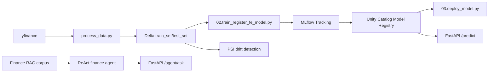

# MLET_TC05

Projeto de entrega Datathon Fase 05 com pipeline MLOps para previsão financeira usando LSTM, Databricks Asset Bundles, MLflow/Unity Catalog, API FastAPI, testes e documentação de governança.

## Arquitetura



## Como Validar Localmente

```bash
uv sync --group dev
uv run ruff check .
uv run pytest
uv build
```

## Como Servir a API

Configure `MODEL_URI` com o modelo registrado no MLflow:

```bash
cp .env.example .env
MODEL_URI=models:/mlops_dev.finance.finance_lstm_model_basic@latest-model uv run uvicorn finance.serving.app:app --host 0.0.0.0 --port 8000
```

Endpoints:

- `GET /health`
- `POST /predict` com payload `{"sequences": [[1.0, 2.0, 3.0]]}`
- `POST /agent/ask` com payload `{"question": "Quando o drift PSI é crítico?"}`

## Agente Financeiro

O pacote `finance.agent` implementa um agente ReAct-style no contexto do projeto financeiro, com RAG local e tools auditáveis:

- `retrieve_finance_context`: busca contexto sobre modelo, pipeline, LGPD e drift.
- `describe_model_config`: resume ativo, target, janela e período de treino.
- `estimate_market_risk`: calcula volatilidade e drawdown aproximados a partir de números informados.
- `explain_drift_policy`: explica thresholds PSI e resposta operacional.

Avaliação offline do golden set:

```bash
uv run python evaluation/ragas_eval.py
```

## Databricks Bundle

O workflow principal está em `databricks.yml`:

- `preprocessing`: baixa dados, cria sequências e grava Delta.
- `train_model`: treina LSTM, registra métricas e publica modelo no Unity Catalog.
- `deploy_model`: valida carregamento do alias `latest-model`.
- `post_commit_status`: registra status da execução em logs.

Validação e execução no ambiente `dev`:

```bash
databricks bundle validate -t dev --profile dbc-d3858b75-976f
databricks bundle deploy -t dev --profile dbc-d3858b75-976f
databricks bundle run deployment -t dev --profile dbc-d3858b75-976f
```

Se houver múltiplos profiles para o mesmo host, também funciona fixar a variável:

```bash
export DATABRICKS_CONFIG_PROFILE=dbc-d3858b75-976f
databricks bundle validate -t dev
```

## Governança e Evidências

- Model Card: `docs/MODEL_CARD.md`
- System Card: `docs/SYSTEM_CARD.md`
- LGPD: `docs/LGPD_PLAN.md`
- OWASP: `docs/OWASP_MAPPING.md`
- Red Teaming: `docs/RED_TEAM_REPORT.md`
- Evidências operacionais: `docs/evidence/README.md`

## Limitações Conhecidas

- O projeto atual usa dados públicos do `yfinance`, não dados reais da empresa convidada.
- O monitoramento implementa PSI em código; dashboards Prometheus/Grafana ainda precisam ser conectados ao ambiente de execução.
- O agente usa RAG determinístico local para demo e CI. Para produção, conectar um LLM real mantendo as mesmas tools e guardrails.
